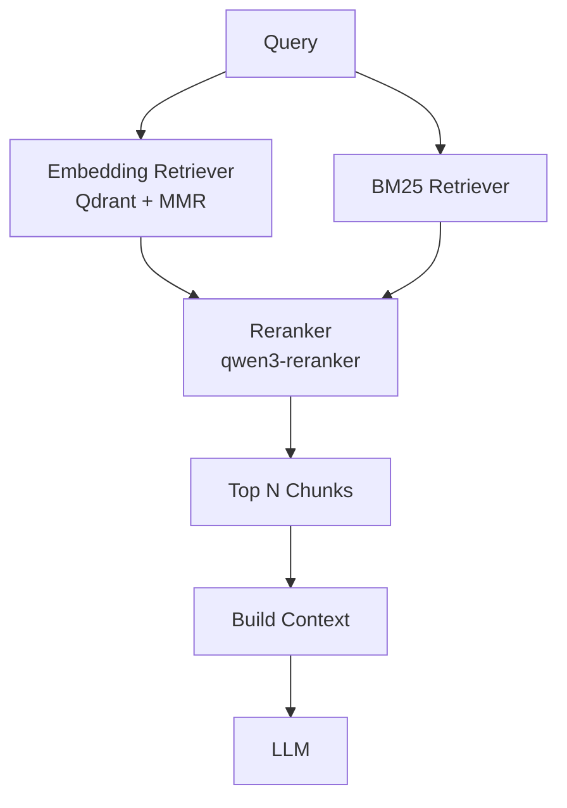
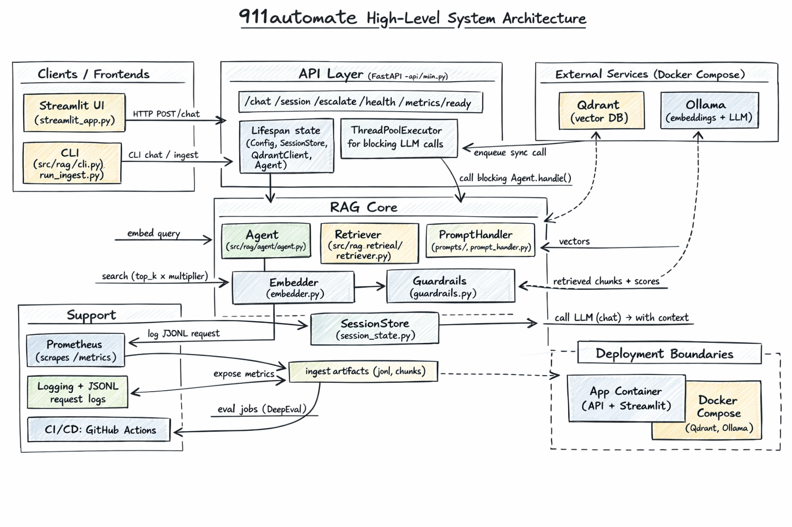

# 911automate

Minimal production-ready Python project for 911/EMS automation with Retrieval-Augmented Generation (RAG).

## Tech Stack

| Layer | Technology |
|-------|------------|
| **Frontend** | Streamlit |
| **API** | FastAPI, Uvicorn |
| **RAG Framework** | LangChain (ollama, openai, community, text-splitters) |
| **Vector DB** | Qdrant |
| **Embeddings** | Ollama (`nomic-embed-text`, 768-dim) |
| **Retrieval** | Hybrid: embedding (Qdrant + MMR) + BM25 (rank_bm25) |
| **Reranking** | Ollama (`sam860/qwen3-reranker:0.6b-Q8_0`) for query-passage scoring |
| **LLM** | Ollama (`llama3.2`) or OpenAI-compatible API |
| **Document Parsing** | PyMuPDF, Docling, pypdf |
| **Dev** | pytest, mypy, yapf |
| **RAG / Prompt Evaluation** | deepeval (CI check) |

---
## Workflow




## System Design (High-Level)




## Design Decisions & Fine-Grained Choices

### Embedding & Chunking

| Decision | Choice | Rationale |
|----------|--------|-----------|
| Embedding model | `nomic-embed-text` (768-dim) via Ollama | Runs locally, no API costs; strong performance on retrieval benchmarks for its size |
| Tokenizer for chunking | `nomic-ai/nomic-embed-text-v1.5` HuggingFace tokenizer | Token-accurate splitting aligned with the embedding model's vocabulary (not character-based) |
| Chunk size | 400 tokens, 50-token overlap | Balances context density with retrieval precision; overlap prevents boundary information loss |
| Minimum chunk filter | 5 tokens | Drops noise chunks (page headers, footers, empty fragments) |
| Chunk ID strategy | SHA-256 of `doc_id:page:chunk_index`, truncated to 16 hex chars → converted to int for Qdrant | Deterministic (re-ingestion is idempotent), collision-resistant |
| Input truncation | 512 tokens max before embedding | Prevents `nomic-embed-text` from silently truncating; applied in `Embedder.embed_texts()` |

### Retrieval

| Decision | Choice | Rationale |
|----------|--------|-----------|
| Vector DB | Qdrant (cosine distance) | Self-hosted, no vendor lock-in; first-class filtering and payload support |
| Hybrid retrieval | Embedding (Qdrant + MMR) + BM25 (rank_bm25) | Combines semantic similarity with lexical/keyword matching; improves recall on specific terms |
| BM25 tokenization | NLTK Porter stemmer + lowercase alphanumeric | Same preprocessing for corpus build (`run_prep_corpus.py`) and query; chunk text read from disk (never stemmed in context) |
| Reranking | Ollama `qwen3-reranker` on (query, passage) pairs | Cross-encoder scoring for final relevance; deduplicates chunks from both retrievers by chunk filename |
| Top chunks to LLM | `reranker_top_n` (default 3) | Reduces context size while keeping highest-scoring passages |
| MMR (embedding path) | λ=0.5, candidate multiplier 2× | Balances relevance with diversity before BM25 merge |
| L2 normalization | Applied post-embedding | Ensures cosine similarity is equivalent to dot product for Qdrant |

### Agent & LLM

| Decision | Choice | Rationale |
|----------|--------|-----------|
| LLM | Ollama `llama3.2` (default), or OpenAI-compatible API via `APILLM` | Local-first for privacy and cost; API fallback for cloud/CI |
| Prompt loading | Per-task YAML files in `prompts/` | Decouples prompt engineering from code; easy A/B testing |
| Context formatting | `[doc_id: X, page: Y]\n\n<chunk_text>` separated by `---` | Gives the LLM source attribution for grounded answers |
| Session management | In-memory `SessionStore` with UUID sessions | Sufficient for single-process; protocol-based for future Redis/DB swap |
| History window | Last 4 turns injected between system and user messages | Keeps context window manageable while preserving conversation continuity |
| Confidence scoring | Mean of retrieval similarity scores | Simple, interpretable; optionally overridden by LLM-parsed confidence |


### API & Deployment

| Decision | Choice | Rationale |
|----------|--------|-----------|
| API framework | FastAPI with async endpoints + thread offload | Non-blocking HTTP serving; blocking Agent calls run in a threadpool |
| Agent initialization | Warm-on-start (background task) or lazy on first `/chat` | Fast server startup; configurable via `agent_warm_on_start` |
| Metrics | Prometheus counters + histograms exposed at `/metrics` | Standard observability; Grafana-ready |
| Request logging | JSONL per-request (question, chunks, answer, confidence, latency) | Enables offline RAG quality analysis without Prometheus |
| Docker services | Qdrant + Ollama with named volumes | Persistent storage across restarts; no data loss on container recreation |

### Evaluation

| Decision | Choice | Rationale |
|----------|--------|-----------|
| Framework | DeepEval | Open-source, supports LLM-as-judge metrics |
| Judge model | Gemini 2.0 Flash | Fast, cost-effective; good correlation with human eval on factual tasks |
| Base model (CI) | Gemini 1.5 Flash | Avoids needing Ollama in GitHub Actions; OpenAI-compatible endpoint |
| Retrieval in eval | Bypassed (`GoldContextRetriever`) | Isolates prompt+LLM quality from retrieval quality |
| Gold set schema | `{input, expected_output, context[], source_doc, question_type}` | Minimal but sufficient for relevance + faithfulness metrics |
| CI trigger | Separate `eval.yml` workflow on `prompts/`, `eval/`, `eval_dataset/` changes | Eval only runs when prompt/dataset changes |


## Setup & Run

### Prerequisites

- Python 3.10+
- Qdrant (default: `http://localhost:6333`)
- Ollama (default: `http://localhost:11434`)

### Start dependencies (recommended)

From the project root:

```bash
docker compose up -d
```

Then ensure the required Ollama models are available (note: compose includes an `ollama-init` service that will pull these automatically; you can also run them manually):

```bash
# Option A: manual pulls (recommended if ollama-init is disabled)
docker compose exec ollama ollama pull llama3.2
docker compose exec ollama ollama pull nomic-embed-text:latest
docker compose exec ollama ollama pull sam860/qwen3-reranker:0.6b-Q8_0

# Option B: run the init job on-demand
docker compose run --rm ollama-init
```

### Install

From the project root:

```bash
bash scripts/bootstrap.sh
```

On Linux/macOS:

```bash
chmod +x scripts/bootstrap.sh
./scripts/bootstrap.sh
```

### Activate Environment

- **Windows:** `. 911env/Scripts/activate`
- **Linux/macOS:** `source 911env/bin/activate`

### Run

**1. Start backend:**

```bash
uvicorn api.main:app --host 0.0.0.0 --port 8000 --reload
```

**2. Start frontend** (in a separate terminal):

```bash
streamlit run streamlit_app.py
```

**3. Ingest documents** (before chat; ensure Qdrant and Ollama are running):

Option A (simple script):

```bash
python run_ingest.py --path data/my.pdf --doc-id my_doc
```

Option B (CLI):

```bash
python -m src.rag.cli ingest --path data/my.pdf --doc-id my_doc
```

**4. Build tokenized corpus for BM25** (after ingestion; enables hybrid retrieval):

```bash
python run_prep_corpus.py
```

This writes `data/prep/tokenized_corpus.jsonl` from all chunks in `data/chunks/`. If this file is missing, the agent falls back to embedding-only retrieval.

### Quick API smoke test

```bash
curl -X POST http://localhost:8000/chat ^
  -H "Content-Type: application/json" ^
  -d "{\"question\":\"What are the steps for adult CPR?\"}"
```

---

## Prompt Evaluation (DeepEval)

- **Gold dataset**: `eval_dataset/911automate_gold_data_prompt_engg.json`
- **Run locally** (dataset validation only):

```bash
python eval/run_eval.py --local-run --dry-run
```

- **Run with judge metrics** (requires `GEMINI_API_KEY`):

```bash
python eval/run_eval.py --local-run
```

## Notes

- **Configuration**: defaults to `config.yml`. Override via `CONFIG_PATH`, `QDRANT_URL`, `OLLAMA_URL`, `API_BASE_URL`, `API_KEY`.
- **Hybrid RAG config** (`config.yml`): `bm25_top_k`, `tokenized_corpus_path`, `reranker_model`, `reranker_top_n` control BM25 retrieval and reranking. BM25 is optional; if the tokenized corpus is missing, the agent uses embedding retrieval only.
- **Eval mode**: `eval_mode: true` disables escalation to keep runs deterministic for evaluation.