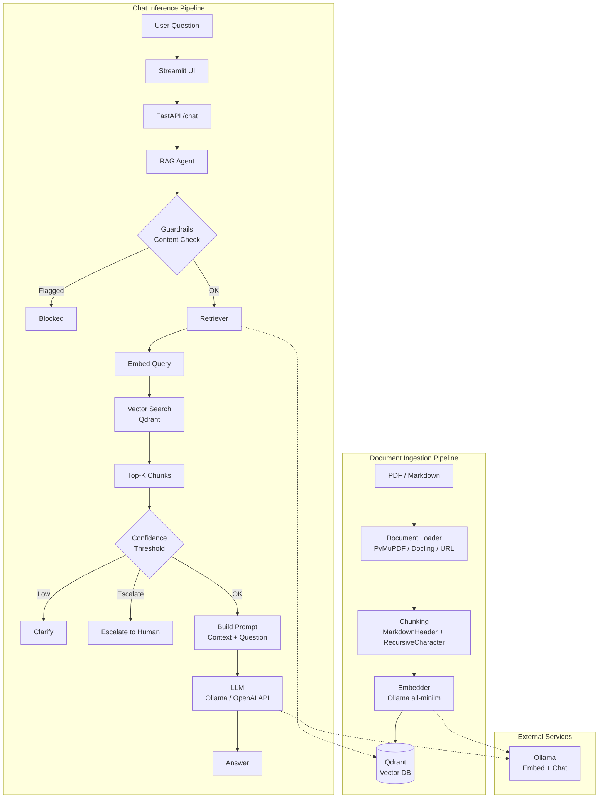

# 911automate

Minimal production-ready Python project for 911/EMS automation with RAG support.

## Tech Stack

| Layer | Technology |
|-------|------------|
| **Frontend** | Streamlit |
| **API** | FastAPI, Uvicorn |
| **RAG Framework** | LangChain (ollama, openai, community, text-splitters) |
| **Vector DB** | Qdrant |
| **Embeddings** | Ollama (all-minilm) |
| **LLM** | Ollama (llama3.2) or OpenAI-compatible API |
| **Document Parsing** | PyMuPDF, Docling, pypdf |
| **Dev** | pytest, mypy, black |

## Setup & Run

### Prerequisites

- Python 3.10+
- [Qdrant](https://qdrant.tech/documentation/quick-start/) (default: `http://localhost:6333`)
- [Ollama](https://ollama.ai/) (default: `http://localhost:11434`)

### Install

From the project root:

```bash
bash scripts/bootstrap.sh
```

On Linux/macOS:

```bash
chmod +x scripts/bootstrap.sh
./scripts/bootstrap.sh
```

### Activate Environment

- **Windows:** `. 911env/Scripts/activate`
- **Linux/macOS:** `source 911env/bin/activate`

### Run

**1. Start backend:**

```bash
uvicorn api.main:app --host 0.0.0.0 --port 8000 --reload
```

**2. Start frontend** (in a separate terminal):

```bash
streamlit run streamlit_app.py
```

**3. Ingest documents** (before chat; ensure Qdrant and Ollama are running):

Use `notebooks/poc.ipynb` or `src/rag/call_ingestion.py` to load PDFs, chunk, embed, and upsert to Qdrant.

---

## ML System Design


